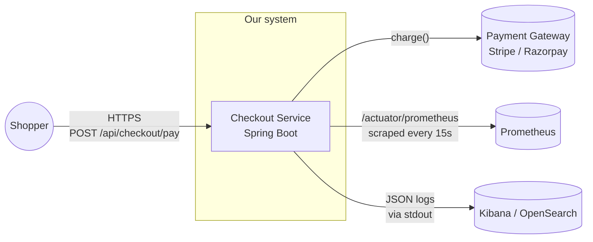
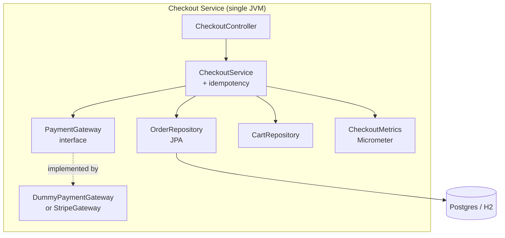
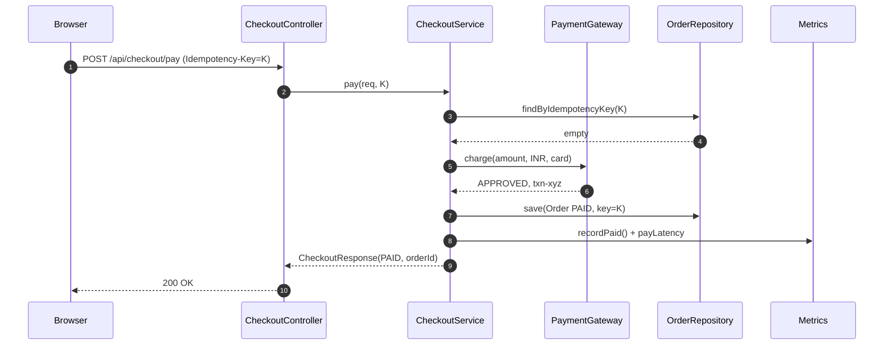
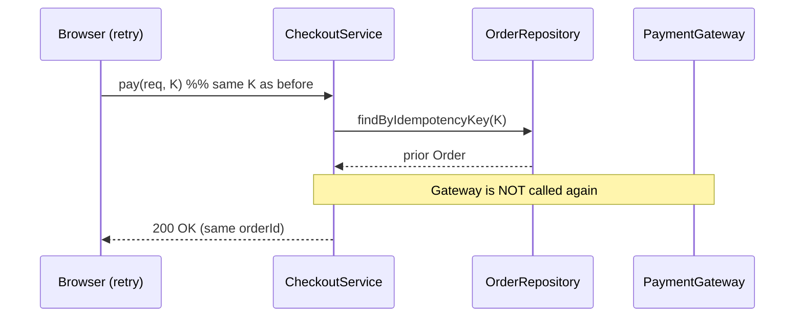
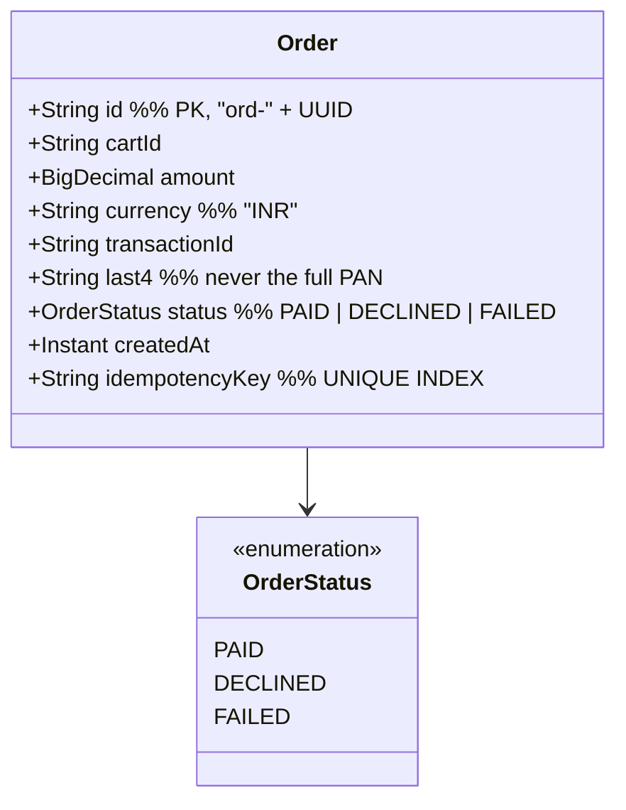
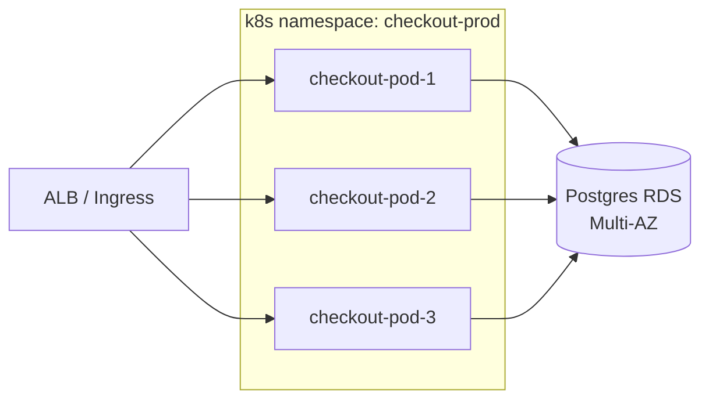

# Architecture

> Visual reference. For *why* a particular choice was made, see
> [`adr/`](adr/). For the original design rationale, see
> [`../02-Technical-Design/technical-design.md`](../02-Technical-Design/technical-design.md).

---

## C4 Level 1 — System context



## C4 Level 2 — Containers



## Request flow — successful checkout



## Request flow — idempotent replay



## Data model



## Module dependency rule

```
controller ──▶ service ──▶ repository / gateway
                 │
                 └──▶ metrics
```

A lower layer never imports a higher one. CI can enforce this with
ArchUnit (planned — see [`adr/0003-archunit-layer-tests.md`](adr/0003-archunit-layer-tests.md) once written).

## Deployment topology (target)



> Why 3 pods? Idempotency is enforced at the DB layer (UNIQUE index), so
> horizontal scaling is safe. See [`adr/0002-idempotency-in-db.md`](adr/0002-idempotency-in-db.md).
